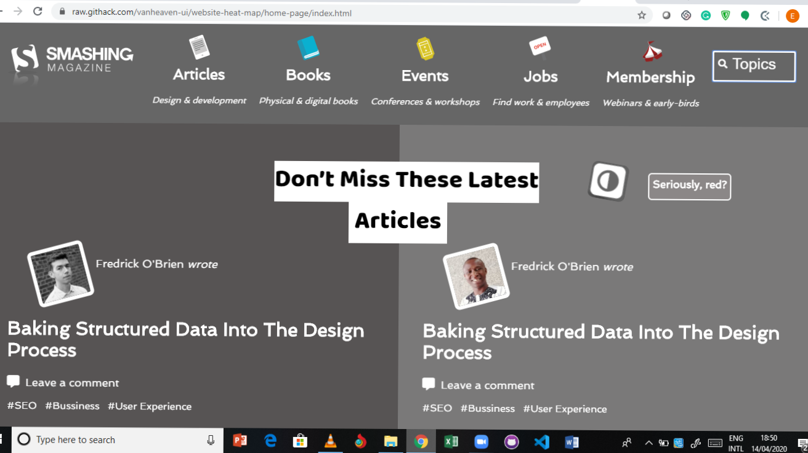

# website-heat-map
This project was completed under the Microverse remote software development curriculum. The project specific requirements included creating a gray heatmap of the original website at [original](https://www.smashingmagazine.com/"). We applied visual heirarchy principles and various typography from google fonts to provide a browsing guide.

Here's the screenshot of the developed web page.

Here's a <a href="https://raw.githack.com/vanheaven-ui/website-heat-map/master/index.html">live link</a>

Here is how the page was structured:
The page is divided into three main sections as below;
- the header section which encloses the navigation. Navigation was achieved by using unordered list.
- the main section which comprises of six sections that wrap the articles and the side bars.
- the footer section  

Built With
- HTML,
- CSS

## Authors

👤 **Kiptoo Hillary**

- Github: [@githubhandle](https://github.com/imhilla)
- Twitter: [@twitterhandle](https://twitter.com/hillarykiptoo_)
- Linkedin: [linkedin]()
- Email: [Email](hillaryodhiambo282@gmail.com) 

👤 **Mworekwa Ezekiel**

- Github: [@githubhandle](https://github.com/vanheaven-ui)
- Twitter: [@twitterhandle](https://twitter.com/MworekwaE)
- Linkedin: [linkedin](https://linkedin.com/in/vanheaven/)
- Email: [Email](vanheaven6@gmail.com)  

🤝 Contributing
Contributions, issues and feature requests are welcome!

Feel free to check the issues page on [issues](https://github.com/vanheaven-ui/website-heat-map/issues).

Show your support
Give a ⭐️ if you like this project!

 
